<p align="center">
  <a href="http://nestjs.com/" target="blank"></a>
   <a href="https://www.typescriptlang.org/" target="_blank">
  
</a>
</p>

# <p align="center">🚀 Habits Tracker Backend</p>

  <p align="center">Shaxsiy rivojlanish va odatlarni kuzatish ilovasi uchun xavfsiz va aqlli backend.</p>

<div align="center">
<a href="https://www.prisma.io/" target="_blank">
  
</a>
<a href="https://www.postgresql.org/" target="_blank">
  
</a>
<a href="https://redis.io/" target="_blank">
  
</a>
<a href="https://nestjs.com/" target="_blank">
  
</a>
<a href="https://www.npmjs.com/package/bcrypt" target="_blank">
  
</a>
<a href="https://jwt.io/" target="_blank">
  
</a>
<a href="https://nodemailer.com/about/" target="_blank">
  
</a>
<a href="https://expressjs.com/" target="_blank">
  
</a>
<a href="https://www.typescriptlang.org/" target="_blank">
  
</a>
<a href="https://nodejs.org/" target="_blank">
  
</a>
</div>
</p>

<details>
  <summary style="font-size:16px; font-weight:600; color:#3b82f6;">📌 Loyihaning umumiy diogrammasi</summary>

  <div align="center ">
    
  </div>
</details>
<details>
<summary style="font-size:16px; font-weight:600; color:#3b82f6;">📡 API Overview</summary>
<div align="center">
 <details>

 <summary>🔐 Auth</summary>

### Auth Endpoints

<div align="left">

~~~js
POST /auth/register     // Foydalanuvchini ro‘yxatdan o‘tkazish (OTP yuboriladi)
POST /auth/verify-otp   // Emailga yuborilgan OTP kodni tasdiqlash
POST /auth/login        // Login qilish va access + refresh token olish
POST /auth/refresh      // Refresh token orqali yangi access token yaratish
POST /auth/logout       // Sessionni yopish va tokenlarni bekor qilish
~~~
</div>
</details>

<details>

<summary>👤 Users</summary>

### User Endpoints

<div align="left">

~~~js
POST   /users          // Yangi user yaratish
GET    /users          // Barcha userlarni olish (pagination bilan)
GET    /users/:id      // Userni ID orqali olish
PATCH  /users/:id      // User ma’lumotlarini yangilash
DELETE /users/:id      // Userni o‘chirish
~~~
</div>

</details>
</div>

</details>

<details>
<summary style="font-size:16px; font-weight:600; color:#3b82f6;">📘 Description</summary>
<div style="border-left: 3px solid #3b82f6; padding-left: 50px; margin-left: 6px;">
<h3>🧠 Backend haqida</h3>
Ushbu backend <b>NestJS</b>, <b>Prisma</b> va <b>TypeScript</b> asosida qurilgan bo‘lib,  
<b>tezkor</b>, <b>xavfsiz</b> va <b>oson kengaytiriladigan arxitektura</b>ga ega.
<h3>✨ Muhim jihatlar</h3>
<hr>
<ul>
<li>💾 <b>Ishonchli ma’lumotlar bazasi operatsiyalari</b><br>
Prisma tranzaksiyalari orqali ma’lumotlar yaxlitligi ta’minlanadi.</li>
<li>⚡ <b>Toza va kengaytiriladigan struktura</b><br>
Odatlar, maqsadlar va shaxsiy rivojlanish modullarini qo‘shish uchun tayyor arxitektura.</li>
</ul>
🚀 Ushbu backend <b>Habits Tracker</b> ilovasining yuragi bo‘lib,  
foydalanuvchilarga odatlarni kuzatish, rivojlanishni boshqarish va  
<b>xavfsiz tarzda o‘sishni</b> ta’minlaydi.
</div>
<br>
</details>


## Project setup

```bash
$ npm run start:dev #loyhani ishga tushirish
```

# <p align="center">🏗 Architecture Overview</p>
  <p align="center">Tizim servislar, ma’lumotlar bazasi va kesh qatlamlari o‘rtasida aniq ajratilgan mas’uliyat tamoyiliga asoslanadi.</p>

### 1️⃣ 🔐 Authentication & Authorization System
Kengaytirilgan xavfsizlik mexanizmlariga ega JWT asosidagi autentifikatsiya tizimi. 
OTP tasdiqlash, refresh token rotation, IP rate limiting va token reuse detection orqali himoyalangan.

<details>
<summary style="font-size:18px; font-weight:700; color:#22c55e;">📝 Auth → Register (Advanced Secure Flow)</summary>

<br>

---

#  Register tizimi haqida

Ushbu `register` oddiy foydalanuvchi yaratish funksiyasi emas.  
Bu production-ready, xavfsiz va professional darajadagi **multi-layer validation + OTP verification** tizimidir.

Oddiy register’dan farqli ravishda bu yerda:

- ❌ Oddiy ma’lumot saqlash yo‘q  
- 🔐 Kuchli xavfsizlik tekshiruvlari mavjud  
- 📧 Email tasdiqlash majburiy  
- 🔄 Pending user uchun OTP resend mexanizmi bor  
- 🧠 Ma’lumotlar tranzaksiya orqali saqlanadi  

---

# 🧩 Register Flow Bosqichlari

---

## 1️⃣ 🎂 Birth Date Validation (Kengaytirilgan tekshiruv)

- 📌 Faqat valid timestamp qabul qilinadi
- ❌ Noto‘g‘ri format rad etiladi
- ❌ Kelajak sanasi mumkin emas
- ❌ 1900-yildan eski sana mumkin emas
- 🌍 Xatolik xabarlari `locale` asosida qaytariladi

👉 Bu noto‘g‘ri yoki manipulyatsiya qilingan ma’lumotlarni oldini oladi.

---

## 2️⃣ 🔑 Strong Password Validation

Password oddiy emas. Quyidagilar majburiy:

- 🔡 Kamida 1 ta kichik harf
- 🔠 Kamida 1 ta katta harf
- 🔢 Kamida 1 ta raqam
- 🔐 Kamida 1 ta maxsus belgi
- 📏 Minimum 8 ta belgi

Weak password → darhol `400 BadRequest`

---

## 3️⃣ 👤 User Exists Smart Check

Email yoki username bazada tekshiriladi.

### Holatlar:

### ✅ ACTIVE user bo‘lsa:
- ❌ Register to‘xtatiladi
- `409 Conflict`

### 🕒 PENDING user bo‘lsa:
- 🔄 Yangi OTP yaratiladi
- 🔐 OTP hash qilinadi
- 💾 userSession ga yoziladi
- 📧 Email qayta yuboriladi
- 🔁 Yangi user yaratmaydi

👉 Bu duplicate account ochilishini oldini oladi.

---

## 4️⃣ 🔐 Password Hashing

- `bcrypt` bilan hash qilinadi
- Plain password hech qachon saqlanmaydi

---

## 5️⃣ 🔢 OTP Generation & Hash

- 6 xonali OTP generatsiya qilinadi
- 5 daqiqa amal qiladi
- OTP ham `bcrypt` orqali hash qilinadi
- Plain OTP bazada saqlanmaydi

---

## 6️⃣ 🧼 Email Normalization

- Email `toLowerCase()`
- `trim()` qilinadi

👉 Duplicate email risk kamayadi.

---

## 7️⃣ 🏗 Prisma Transaction

Quyidagilar **bitta transaction** ichida bajariladi:

- 👤 User yaratish
- 🔐 OTP bilan userSession yaratish

Agar bittasi xato bersa — hammasi rollback bo‘ladi.

---

## 8️⃣ 📧 OTP Email Yuborish

- Transaction tugagandan keyin yuboriladi
- Database consistency saqlanadi

---

## 9️⃣ 🌍 Localized Response System

Barcha xatolik va success xabarlari:

- 🇺🇿 Uzbek
- 🇷🇺 Russian
- 🇬🇧 English

`dto.locale` asosida ishlaydi.

---

# 🛡 Security Advantages

Bu register tizimi:

- 🔒 Hashlangan password
- 🔐 Hashlangan OTP
- 🔁 OTP resend protection
- 🧠 Smart status handling (ACTIVE / PENDING)
- 💾 Transactional safety
- 🌍 Localized errors
- ❌ Duplicate protection
- 📅 Strict data validation

---

# ⚡ Oddiy Register’dan Farqi

| Oddiy Register | Sizning Register |
|---------------|------------------|
| Faqat user create | Multi-layer validation |
| OTP yo‘q | OTP verification system |
| Transaction yo‘q | Prisma transaction |
| Password minimal check | Strong regex validation |
| Duplicate muammo | Smart status logic |
| Email normalize qilinmaydi | Normalize qilinadi |
| Plain OTP | Hashed OTP |

---

# 🧠 Xulosa

Bu `register` production darajadagi,  
enterprise xavfsizlik standartlariga yaqinlashtirilgan tizim bo‘lib:

> 🔥 Account abuse oldini oladi  
> 🔥 Duplicate user yaratmaydi  
> 🔥 Ma’lumotlar yaxlitligini saqlaydi  
> 🔥 OTP orqali haqiqiy email egasini tasdiqlaydi  

Bu oddiy CRUD emas — bu real security flow.

<br>
</details>


<br>
<br>
<br>
<br>
<br>
<br>
<br>
<br>
<br>
<br>
<br>
<br>
<br>
<br>
<br>
<br>
<br>
<br>
<br>
<br>
<br>
<br>
## Compile and run the project

```bash
# development
$ npm run start

# watch mode
$ npm run start:dev

# production mode
$ npm run start:prod
```

## Run tests

```bash
# unit tests
$ npm run test

# e2e tests
$ npm run test:e2e

# test coverage
$ npm run test:cov
```

## Deployment

When you're ready to deploy your NestJS application to production, there are some key steps you can take to ensure it runs as efficiently as possible. Check out the [deployment documentation](https://docs.nestjs.com/deployment) for more information.

If you are looking for a cloud-based platform to deploy your NestJS application, check out [Mau](https://mau.nestjs.com), our official platform for deploying NestJS applications on AWS. Mau makes deployment straightforward and fast, requiring just a few simple steps:

```bash
$ npm install -g @nestjs/mau
$ mau deploy
```

With Mau, you can deploy your application in just a few clicks, allowing you to focus on building features rather than managing infrastructure.

## Resources

Check out a few resources that may come in handy when working with NestJS:

- Visit the [NestJS Documentation](https://docs.nestjs.com) to learn more about the framework.
- For questions and support, please visit our [Discord channel](https://discord.gg/G7Qnnhy).
- To dive deeper and get more hands-on experience, check out our official video [courses](https://courses.nestjs.com/).
- Deploy your application to AWS with the help of [NestJS Mau](https://mau.nestjs.com) in just a few clicks.
- Visualize your application graph and interact with the NestJS application in real-time using [NestJS Devtools](https://devtools.nestjs.com).
- Need help with your project (part-time to full-time)? Check out our official [enterprise support](https://enterprise.nestjs.com).
- To stay in the loop and get updates, follow us on [X](https://x.com/nestframework) and [LinkedIn](https://linkedin.com/company/nestjs).
- Looking for a job, or have a job to offer? Check out our official [Jobs board](https://jobs.nestjs.com).

## Support

Nest is an MIT-licensed open source project. It can grow thanks to the sponsors and support by the amazing backers. If you'd like to join them, please [read more here](https://docs.nestjs.com/support).

## Stay in touch

- Author - [Kamil Myśliwiec](https://twitter.com/kammysliwiec)
- Website - [https://nestjs.com](https://nestjs.com/)
- Twitter - [@nestframework](https://twitter.com/nestframework)

## License

Nest is [MIT licensed](https://github.com/nestjs/nest/blob/master/LICENSE).
